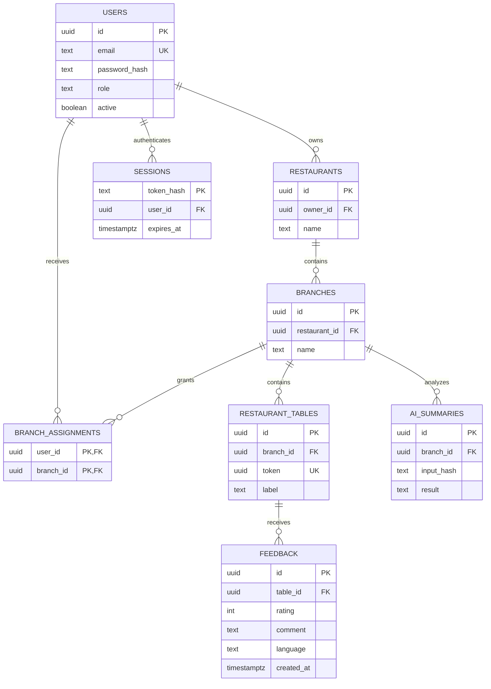

# Database ERD

```mermaid
erDiagram
 USERS ||--o{ RESTAURANTS : owns
 USERS ||--o{ BRANCH_ASSIGNMENTS : receives
 USERS ||--o{ SESSIONS : authenticates
 RESTAURANTS ||--o{ BRANCHES : contains
 BRANCHES ||--o{ BRANCH_ASSIGNMENTS : grants
 BRANCHES ||--o{ RESTAURANT_TABLES : contains
 RESTAURANT_TABLES ||--o{ FEEDBACK : receives
 BRANCHES ||--o{ AI_SUMMARIES : analyzes
 USERS { 
 uuid id PK
 text email UK
 text password_hash
 text role
 boolean active
 }
 RESTAURANTS {
 uuid id PK
 uuid owner_id FK
 text name
 }
 BRANCHES {
 uuid id PK
 uuid restaurant_id FK
 text name
 }
 BRANCH_ASSIGNMENTS {
 uuid user_id PK,FK
 uuid branch_id PK,FK
 }
 RESTAURANT_TABLES {
 uuid id PK
 uuid branch_id FK
 uuid token UK
 text label
 }
 FEEDBACK {
 uuid id PK
 uuid table_id FK
 int rating
 text comment
 text language
 timestamptz created_at
 }
 SESSIONS {
 text token_hash PK
 uuid user_id FK
 timestamptz expires_at
 }
 AI_SUMMARIES {
 uuid id PK
 uuid branch_id FK
 text input_hash
 text result
 }
```
The migration is authoritative for all fields and constraints.
